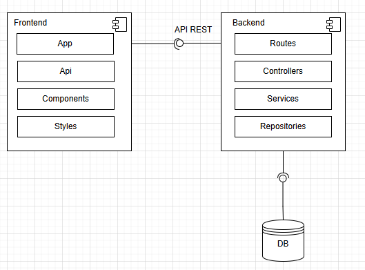

# 2. Arquitetura de software

## Arquitetura Geral

O projeto Adote-Fácil segue uma **Arquitetura em Camadas** , cliente-servidor. A aplicação é dividida em três camadas principais: .
- **Back-end**: responsável pelas regras de negócio e pelo processamento dos dados.
- **Front-end**: responsável pela interface do usuário e interação com o sistema.
- **Banco de Dados**: responsável pelo armazenamento das informações.

Características que comprovam sua arquitetura em camadas: 
- O Back-end se comunica com o Front-end por meio de requisições HTTP (API), caracterizando ambientes independentes.
- Cada camada do sistema é executada em um container isolado, o que garante maior independência e escalabilidade.
- O Docker Compose é utilizado para orquestrar os containers, porém cada serviço também pode ser executado individualmente, se necessário.

```
adote-facil-postgres:
  image: postgres:14-alpine
  container_name: 'adote-facil-postgres'
  env_file:
  ./backend/.env 
```

```
adote-facil-backend:
    build:
      context: ./backend
      dockerfile: Dockerfile
    container_name: 'adote-facil-backend'
```

```
adote-facil-frontend:
    build:
      context: ./frontend
      dockerfile: Dockerfile
    container_name: 'adote-facil-frontend'
```

---


## Arquitetura Back-end e Front-end

O back-end isoladamente segue uma arquitetura **Monolítica Estruturada** . Trata-se de um único processo independente, com deploy centralizado, mas que apresenta uma organização interna em módulos.

As principais características são:
- O sistema é composto por módulos (como usuário, animal e chat), mas todos estão integrados dentro do mesmo projeto, executado em um único processo Node.js.
- O deploy é realizado de forma unificada: não é possível atualizar apenas um módulo isoladamente, sendo necessário compilar e disponibilizar todo o back-end novamente.
- Apesar de ser monolítico, o projeto segue uma organização em camadas, como:
  - **Rotas**: responsáveis pelo mapeamento das requisições;
  - **Controllers**: responsáveis por receber as requisições e direcionar o fluxo da aplicação;
  - **Serviços**: onde estão centralizadas as regras de negócio;
  - **Repositories**: responsáveis pela comunicação com o banco de dados.

```
adote-facil-backend:
    build:
      context: ./backend
      dockerfile: Dockerfile
    container_name: 'adote-facil-backend'
    ports:
      - "8080:8080"
```

---

## Diagrama de Componentes
Diagrama de componentes do projeto Adote-Fácil:




